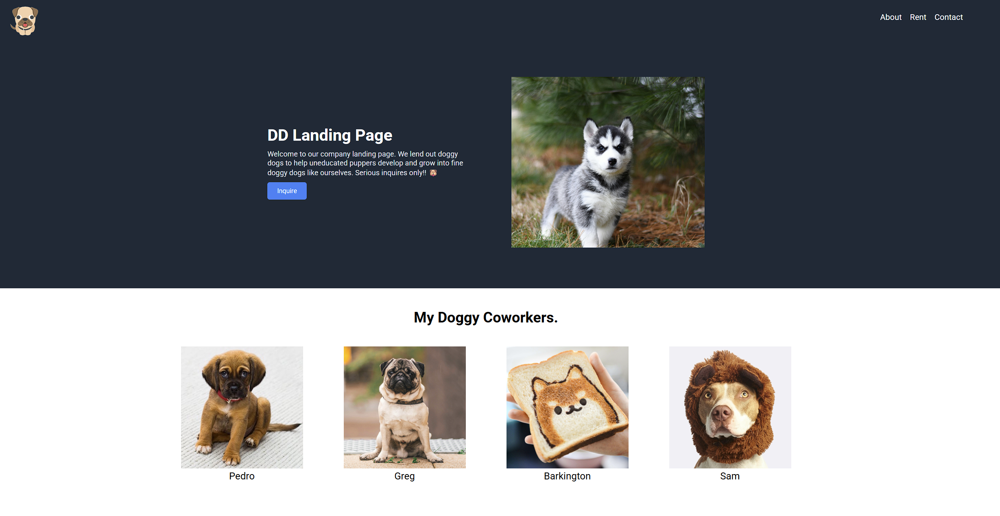

# Landing Page

A mockup landing page with buttons, pictures, and style

Built as part of [The Odin Project](https://www.theodinproject.com/) curriculum to practice **HTML**, **CSS**, and **forming a well structured webpage using Flexbox**.

## Features

- Formatted page with different sections using Flexbox
- Nice looking dog pictures

## Demo

### [Live Demo](https://songzhang015.github.io/project-2-landing-page/)

## Built Using

- HTML
- CSS
